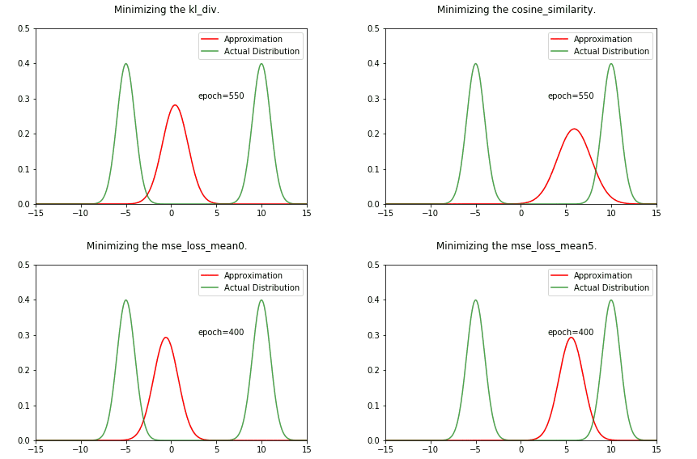

KL-Div

I got curious about KL Divergence after reading the Variational Auto Encoder Paper. So, I decided to investigate it to get a better intuition.

KL Divergence is a measure of how one probability distribution (P
) is different from a second probability distribution (Q). If two distributions are identical, their KL div. should be 0. Hence, by minimizing KL div., we can find paramters of the second distribution (Q) that approximate P.

In this notebook i try to approximate the distribution P
(sum of two gaussians) by minimizing its KL divergence with another gaussian distribution Q

